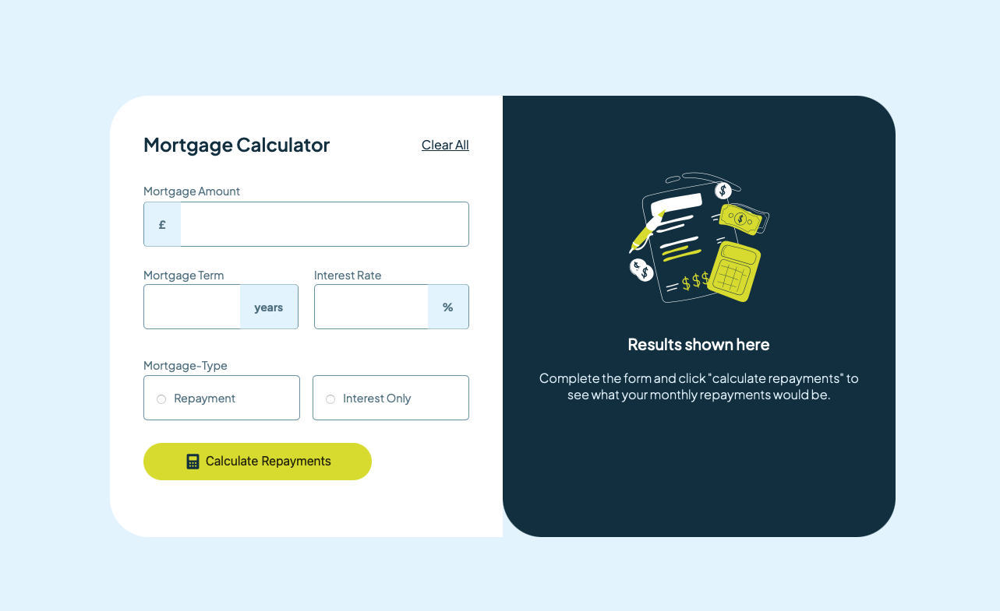

# Frontend Mentor - Mortgage repayment calculator solution
This is a solution to the Mortgage Repayement calculator challenge on Frontend mentor.

Users should be able to:

- Input mortgage information and see monthly repayment and total repayment amounts after submitting the form
- See form validation messages if any field is incomplete
- Complete the form only using their keyboard
- View the optimal layout for the interface depending on their device's screen size
- See hover and focus states for all interactive elements on the page

### Screenshot

### Links

- Solution URL: [Add solution URL here]()
- Live Site URL: [Add live site URL here]()

### Built with

- Semantic HTML5 markup
- CSS custom properties
- Flexbox
- CSS 
- Mobile-first workflow
