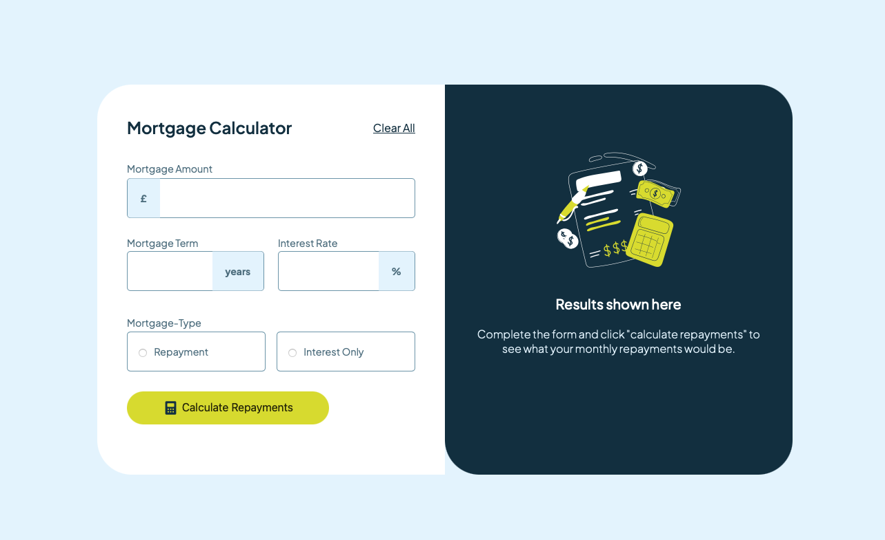

# Mortgage Repayment Calculator
This calculator takes in total mortgage amount in Euros, along with the term, interest rate, and mortgage type to give the monthly repayment amount and the amount paid by the end of the complete term.

## Table of Contents
- [Overview](#overview)
- [Screenshot](#screenshot)
- [Links](#links)
- [Built With](#built-with)
- [What I Learned](#what-i-learned)
- [Acknowledgments](#acknowledgments)

## Overview
Users should be able to:
- Input mortgage information and see monthly repayment and total repayment amounts after submitting the form
- See form validation messages if any field is incomplete
- Complete the form only using their keyboard
- View the optimal layout for the interface depending on their device's screen size
- See hover and focus states for all interactive elements on the page

### Screenshot

### Links
- Solution URL: (https://github.com/Akshatasarawgi/Mortgage-Calculator)
- Live Site URL: (https://beamish-hamster-25cac0.netlify.app)

### Built with
JavaScript
HTML
CSS
