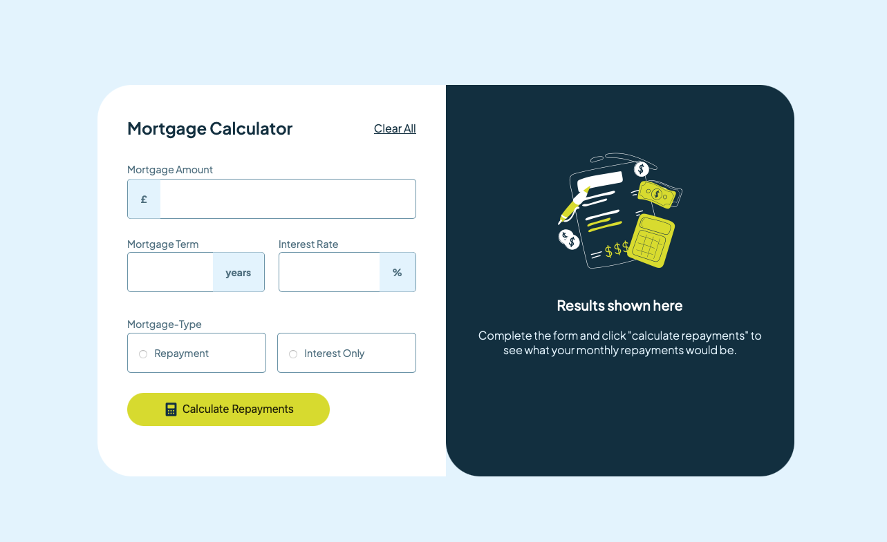

# Frontend Mentor - Mortgage repayment calculator solution
This is a solution to the Mortgage Repayement calculator challenge on Frontend mentor.

Users should be able to:
- Input mortgage information and see monthly repayment and total repayment amounts after submitting the form
- See form validation messages if any field is incomplete
- Complete the form only using their keyboard
- View the optimal layout for the interface depending on their device's screen size
- See hover and focus states for all interactive elements on the page

### Screenshot

### Links

- Solution URL: (https://github.com/Akshatasarawgi/Mortgage-Calculator)
- Live Site URL: (https://beamish-hamster-25cac0.netlify.app)

### Built with
JavaScript
HTML
CSS

